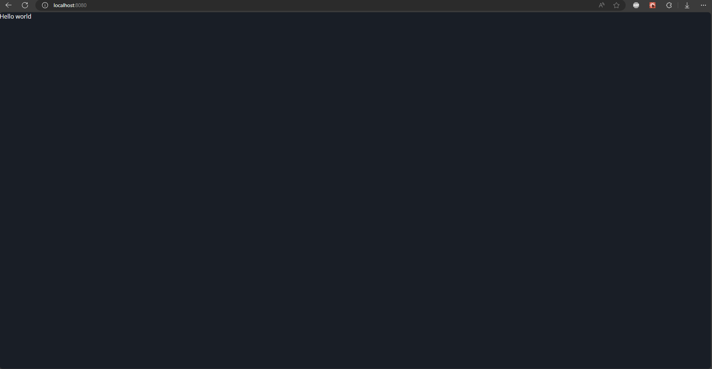
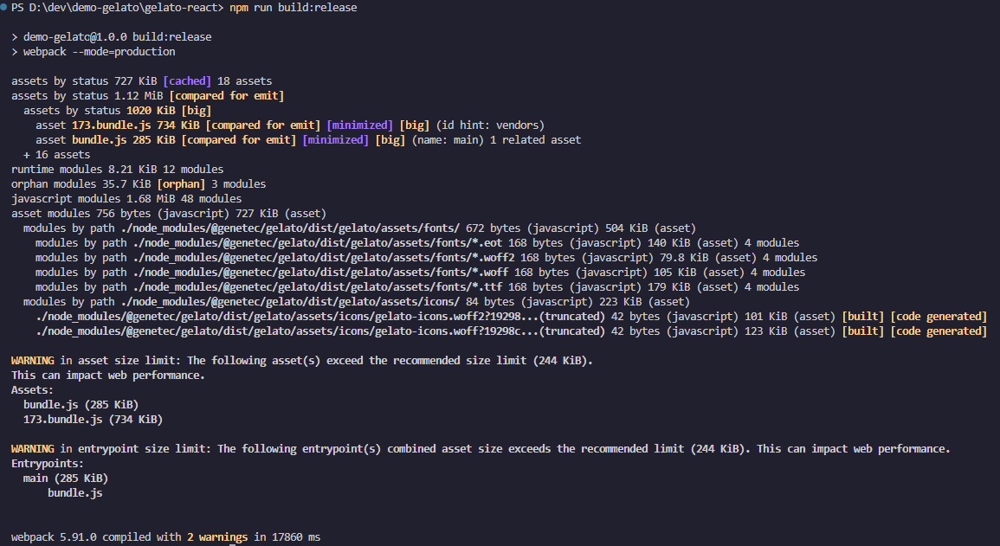
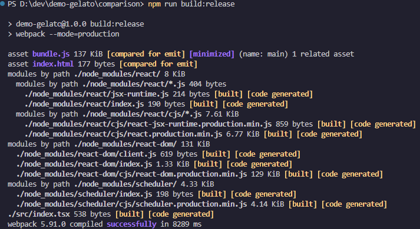
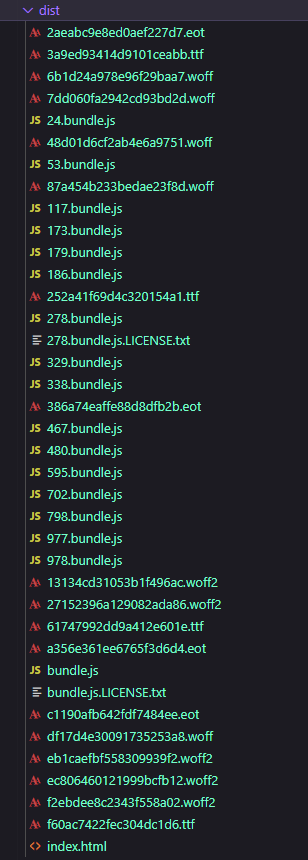
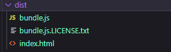

# Gelato test project

## Introduction

This project is made to show the issues that occurs when using gelato-react with webpack.

## How to use the project

To run the the project, there are three available commands:

#### Start the dev server 

```ps1
npm run start
```

#### Build the project in debug mode
```ps1
npm run build:debug
```

#### Build the project in production mode
```ps1
npm run build:release
```

</br>

The two build commands will generate the output files in the ***dist/*** directory.

## The setup

The project requires only three dependencies:
- React
- React-DOM
- Gelato-React

The dev dependencies are:
- webpack
- typescript
- misc file loaders such as
    - ts-loader
    - style-loader
    - css-loader

The project only has setup for a basic react project and an *hello world* div

```tsx
import { StrictMode, Suspense } from 'react'
import { createRoot } from 'react-dom/client'
import { defineCustomElements } from '@genetec/gelato-react'
import { GenDesignSystemProvider } from '@genetec/gelato-react'
import '@genetec/gelato-react/dist/index.css'

defineCustomElements()

const container = document.getElementById('root');
if (container) {
    const root = createRoot(container);
    root.render(
        <StrictMode>
            <Suspense fallback="Loading...">
                <GenDesignSystemProvider useTopLevelStyles={true}>
                    <div>Hello world</div>
                </GenDesignSystemProvider>
            </Suspense>
        </StrictMode>
    );
}

```

Here is an example of what the page looks like




## The problem

What I can see is that when build the project, a few bundles are not minified, a lot of font files are added and the project grows exponentially. I will be listing some metrics down below by comparing the data of the same project but without the use of Gelato-react.

### The setup for the comparison project

It uses the same architecture as the gelato-project but I remove all dependencies to gelato-react from the package.json

```tsx
import { StrictMode, Suspense } from 'react'
import { createRoot } from 'react-dom/client'

const container = document.getElementById('root');
if (container) {
    const root = createRoot(container);
    root.render(
        <StrictMode>
            <Suspense fallback="Loading...">
                <div>Hello world</div>
            </Suspense>
        </StrictMode>
    );
}

```

### Executing npm run build:release

#### Gelato-react


#### Comparison project


### The results

Everything will be compared using the production build command


| Data                | Gelato-React | Comparison |
| ---------           | :----------: | ---------: |
| Build time          | 17 860ms     | 8 289ms    |
| Dist size           | 1.82 MB      | 137 KB     |
| Main bundle.js size | 285 KB       | 136 KB     |
| Warnings            | 2            |  0         |


As we can see there's a significant regression when using gelato:

**Build time**: <span style="color: #FF474C">+215%</span> (9 571ms diff) </br>
**Dist size**: <span style="color: #FF474C">+1328%</span> (1683 KB diff) </br>
**Main bundle.js size**: <span style="color: #FF474C">+208%</span> (149 KB diff) </br>
**Warnings**: <span style="color: #FFA756">2 warnings</span> (2 diff) </br>


## Comparing the dist

There's also a major difference in the output of the two projects

### Gelato-react



## Comparison project
